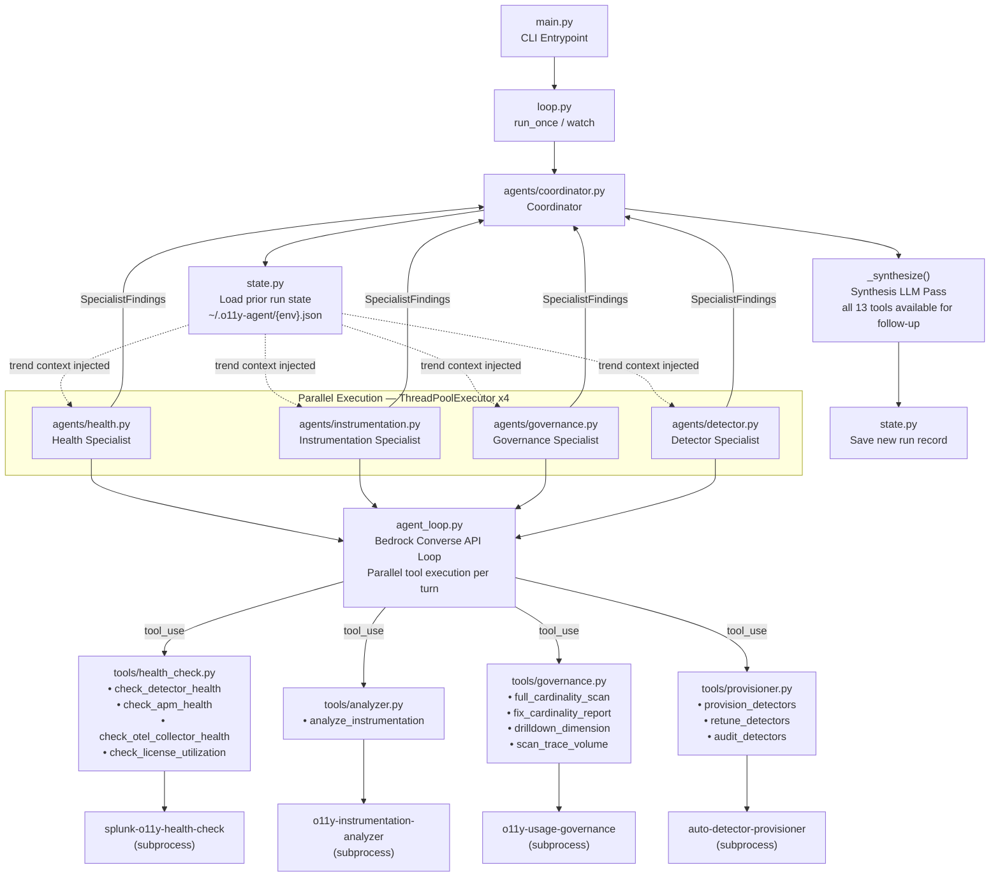
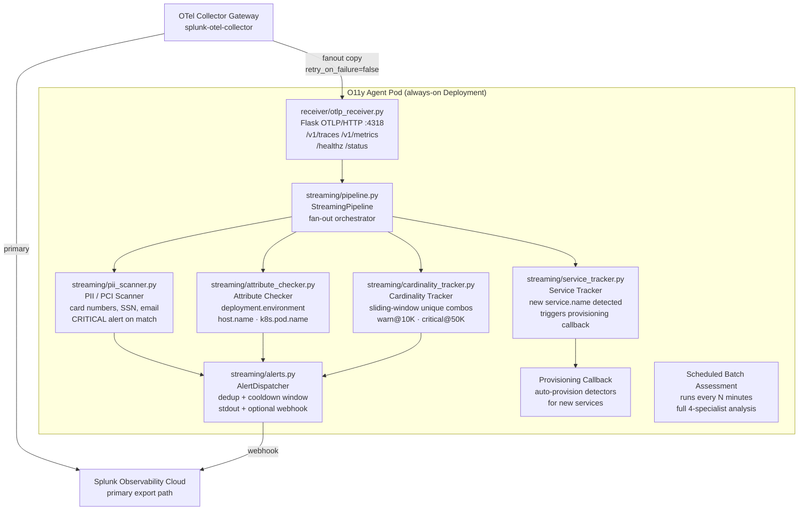

# Autonomous O11y Agent

Autonomous observability agent for Splunk Observability Cloud. Runs four specialist AI agents in parallel — health auditing, instrumentation analysis, cardinality governance, and detector lifecycle — then synthesizes their findings into a prioritized assessment using Claude via AWS Bedrock.

---

## Deployment Modes

The agent supports two deployment modes depending on your use case:

| Mode | How | Best for |
|---|---|---|
| **Batch** | CronJob (or local cron) | Periodic deep assessments — no persistent pod required |
| **Streaming** | Always-on Deployment + OTLP/HTTP receiver | Real-time PII detection, attribute validation, cardinality alerts as telemetry flows through |

In **streaming mode**, the agent co-deploys alongside your OTel Collector **gateway** node. The gateway fans a copy of all traces and metrics to the agent's OTLP/HTTP receiver (port 4318) via a secondary exporter configured with `retry_on_failure: false` — so the agent is never on the critical path for the primary Splunk export.

---

## Architecture

### Batch Mode (Periodic Assessment)



### Streaming Mode (Gateway Co-Deployment)



### Component Breakdown

| Layer | File(s) | Responsibility |
|---|---|---|
| **Entrypoint** | `main.py`, `loop.py` | CLI arg parsing, batch/streaming mode, watch loop |
| **Coordinator** | `agents/coordinator.py` | Parallel specialist dispatch, cross-domain analysis, synthesis, state |
| **Agent Loop** | `agent_loop.py` | Bedrock Converse API tool-calling loop; concurrent tool execution per turn |
| **Specialists** | `agents/health.py`<br>`agents/instrumentation.py`<br>`agents/governance.py`<br>`agents/detector.py` | Domain-scoped LLM reasoning + structured `SpecialistFindings` output |
| **Tools** | `tools/health_check.py`<br>`tools/analyzer.py`<br>`tools/governance.py`<br>`tools/provisioner.py` | Subprocess wrappers around sibling CLI projects |
| **OTLP Receiver** | `receiver/otlp_receiver.py` | Flask app receiving gateway-fanned traces/metrics; starts in daemon thread |
| **Streaming Pipeline** | `streaming/pipeline.py` | Fan-out orchestrator — routes spans/metrics to all 4 real-time detectors |
| **PII Scanner** | `streaming/pii_scanner.py` | Regex scan of span attributes for PCI card numbers, SSN, email, phone |
| **Attribute Checker** | `streaming/attribute_checker.py` | Validates required OTel attributes on every span/metric data point |
| **Cardinality Tracker** | `streaming/cardinality_tracker.py` | Sliding-window unique-combination counter; generates drop YAML on breach |
| **Service Tracker** | `streaming/service_tracker.py` | Fires provisioning callback on first appearance of a new `service.name` |
| **Alerts** | `streaming/alerts.py` | Thread-safe alert dispatcher: dedup by key+cooldown, stdout + webhook |
| **State** | `state.py` | `RunRecord` with silent services, deployed detector IDs, trend context |
| **Config** | `config.py` | `AgentConfig` dataclass; realm, token, environment, streaming, alerts |
| **Helm Chart** | `charts/o11y-agent/` | `mode.type: streaming` → Deployment; `mode.type: batch` → CronJob |

### Key Design Decisions

**1. Two levels of parallelism**
- The coordinator launches all 4 specialists simultaneously via `ThreadPoolExecutor(max_workers=4)`
- Within each specialist, when Claude returns multiple `tool_use` blocks in one turn, all tools execute concurrently — eliminating sequential bottlenecks inside a single agent turn

**2. Structured output from every specialist**
- Each specialist returns a typed `SpecialistFindings` dataclass (not freeform text)
- Contains: `services_active`, `services_silent`, `instrumentation_score`, `issues[]`, `metrics{}`
- Coordinator's cross-domain analysis and state persistence work from structured fields — no regex extraction

**3. Synthesis with full tool access**
- The final synthesis LLM pass receives all 13 tools (from all 4 specialists) for targeted follow-up
- Can query any domain to verify a cross-cutting finding before writing the report
- Cross-domain analysis (service/issue mapping across all 4 findings) is pre-computed and injected into the synthesis prompt

**4. Persistent memory and trend detection**
- Each run records: instrumentation score, active/silent service names, deployed detector IDs, critical issues
- `trend_context()` explicitly surfaces: previously silent services (verify if now active), detectors deployed last run (verify still present), consecutive silence for 2+ runs
- Stored at `~/.o11y-agent/{environment}.json`, capped at 30 runs per environment

**5. Environment scoping at two layers**
- Hard filter in tool wrappers removes off-environment data before it reaches the LLM
- System prompts explicitly restrict each specialist to the target environment only
- Prevents org-wide noise (other teams' services, other environments) from polluting findings

**6. Gateway co-deployment — agent never on critical path**
- Gateway adds a secondary `otlp/o11y_agent` exporter with `retry_on_failure: false` and `timeout: 5s`
- If the agent pod is unavailable, the gateway drops the copy silently — primary Splunk export is unaffected
- The `gateway-patch-configmap.yaml` Helm template renders a ready-to-use `values.yaml` fragment that ops can apply to their existing `splunk-otel-collector` release with a single `helm upgrade`

**7. No agent framework dependency**
- Pure `boto3` Converse API — no Strands, LangChain, or other framework overhead
- The entire tool-calling loop is ~50 lines in `agent_loop.py`
- Bedrock config: `read_timeout=600` to handle long-running provisioner and synthesis calls

---

## Prerequisites

The four tool projects must be cloned as siblings to this repo:

```
Documents/
  autonomous-o11y-agent/            ← this repo
  auto-detector-provisioner/
  o11y-usage-governance/
  o11y-instrumentation-analyzer/
  splunk-o11y-health-check/
```

Install each project's dependencies:

```bash
pip install -r ../auto-detector-provisioner/requirements.txt
pip install -r ../o11y-usage-governance/requirements.txt
pip install -r ../o11y-instrumentation-analyzer/requirements.txt
pip install -r ../splunk-o11y-health-check/requirements-health-hub.txt
```

## Setup

```bash
cd autonomous-o11y-agent
pip install -e .
```

Required environment variables (or use CLI flags):

| Variable | Description |
|---|---|
| `SPLUNK_REALM` | Splunk Observability realm (e.g. `us1`) |
| `SPLUNK_ACCESS_TOKEN` | Splunk API access token |
| `SPLUNK_ENVIRONMENT` | Target environment name |
| `AWS_DEFAULT_REGION` | AWS region for Bedrock (default: `us-west-2`) |
| `AWS_ACCESS_KEY_ID` | AWS credentials |
| `AWS_SECRET_ACCESS_KEY` | AWS credentials |

Streaming mode environment variables:

| Variable | Default | Description |
|---|---|---|
| `OTLP_RECEIVER_PORT` | `4318` | Port for the OTLP/HTTP receiver |
| `OTLP_RECEIVER_HOST` | `0.0.0.0` | Bind address for the OTLP/HTTP receiver |
| `ALERT_WEBHOOK_URL` | _(none)_ | Optional webhook URL for alert notifications |
| `ALERT_COOLDOWN_SECONDS` | `300` | Minimum seconds between repeated alerts for the same issue |

Optional path overrides (defaults to sibling directories):

| Variable | Description |
|---|---|
| `PROVISIONER_PATH` | Path to auto-detector-provisioner |
| `GOVERNANCE_PATH` | Path to o11y-usage-governance |
| `ANALYZER_PATH` | Path to o11y-instrumentation-analyzer |
| `HEALTH_CHECK_PATH` | Path to splunk-o11y-health-check |

---

## Usage

### Batch Mode

```bash
# One-shot full assessment (dry-run — no changes made)
python3 main.py --realm us1 --token $TOKEN --environment production

# One-shot with auto-apply (deploys detectors, applies fixes)
python3 main.py --realm us1 --token $TOKEN --environment production --auto-apply

# Scope to a specific service
python3 main.py --realm us1 --token $TOKEN --environment production --service payment-service

# Ask the agent a specific question
python3 main.py --realm us1 --token $TOKEN --environment production \
  --prompt "Which services have the worst instrumentation coverage and why?"

# Continuous watch mode — runs every 60 minutes
python3 main.py --realm us1 --token $TOKEN --environment production --watch

# Watch mode with custom interval and auto-apply
python3 main.py --realm us1 --token $TOKEN --environment production \
  --watch --interval 30 --auto-apply
```

### Streaming Mode

```bash
# Start the OTLP/HTTP receiver + run a batch assessment every 60 minutes
python3 main.py --realm us1 --token $TOKEN --environment production --streaming

# Streaming only (receive telemetry + real-time alerts, no batch assessments)
python3 main.py --realm us1 --token $TOKEN --environment production --streaming-only

# Streaming with custom interval and alert webhook
ALERT_WEBHOOK_URL=https://your-webhook.example.com/alerts \
python3 main.py --realm us1 --token $TOKEN --environment production \
  --streaming --interval 30 --auto-apply
```

Once running, the agent listens on `http://0.0.0.0:4318` (configurable via `OTLP_RECEIVER_PORT`). Point your OTel Collector gateway at it:

```yaml
# Add to your gateway exporters:
exporters:
  otlp/o11y_agent:
    endpoint: "http://<agent-host>:4318"
    tls:
      insecure: true
    retry_on_failure:
      enabled: false   # never block primary export path
    timeout: 5s

# Add to each pipeline's exporters list (LAST, after splunk_hec/signalfx):
service:
  pipelines:
    traces:
      exporters: [splunk_hec/traces, signalfx, otlp/o11y_agent]
    metrics:
      exporters: [signalfx, otlp/o11y_agent]
```

### Kubernetes Deployment (Helm)

```bash
# Add the o11y-agent chart (from this repo)
helm install o11y-agent ./charts/o11y-agent \
  --set splunk.realm=us1 \
  --set splunk.accessToken=$SPLUNK_ACCESS_TOKEN \
  --set aws.accessKeyId=$AWS_ACCESS_KEY_ID \
  --set aws.secretAccessKey=$AWS_SECRET_ACCESS_KEY \
  --set aws.region=us-west-2 \
  --set splunk.environment=production

# Streaming mode (default) — deploys an always-on pod with OTLP receiver
# Batch mode — deploys a CronJob instead:
helm install o11y-agent ./charts/o11y-agent \
  --set mode.type=batch \
  --set mode.schedule="0 * * * *" \
  ...

# Patch your existing splunk-otel-collector gateway to fan out to the agent:
helm upgrade splunk-otel-collector splunk-otel/splunk-otel-collector \
  -f <(kubectl get cm o11y-agent-gateway-patch \
           -o jsonpath='{.data.values\.yaml}')
```

The `gateway-patch-configmap.yaml` Helm template renders a `values.yaml` fragment automatically populated with the agent's in-cluster DNS name and receiver port. Apply it to your existing gateway release with the command above — no manual YAML editing required.

---

## What Each Specialist Does

### Health Specialist
- Checks detector alert coverage across all services
- Audits APM health: error rates, latency, and throughput per service
- Checks OTel Collector pipeline health and drop rates
- Reviews license utilization against entitlements

### Instrumentation Specialist
- Analyzes span quality: missing attributes, wrong span kinds, incomplete traces
- Checks metric coverage: which services emit which signal types
- Identifies services with no traces, no metrics, or no logs
- Scores overall instrumentation quality (0–100)

### Governance Specialist
- Scans for metric cardinality explosions with MTS counts and cost estimates
- Detects slow-burn anomalies: metrics growing faster than their 7-day baseline
- Generates ready-to-paste OTel Collector YAML fixes per offending dimension
- Snapshots trace volume per service to detect unexpected spikes

### Detector Specialist
- Discovers services with no detector coverage ("dark" services)
- Learns behavioral baselines from live telemetry (p50/p95/p99, error rates, req rates)
- Provisions or recommends best-practice detectors tuned to actual traffic patterns
- Retunes existing detectors when baselines have drifted
- Auto-detects GenAI/agentic services and applies specialized detector templates

---

## Project Structure

```
autonomous-o11y-agent/
├── main.py                   # CLI entrypoint — batch + streaming flags
├── loop.py                   # run_once() and watch() loop
├── agent.py                  # build_agent() — wires config to coordinator
├── agent_loop.py             # Bedrock Converse API tool-calling loop
├── config.py                 # AgentConfig dataclass (incl. streaming fields)
├── state.py                  # RunRecord + trend_context() + build_run_record()
├── generate_report.py        # DOCX report generator
├── agents/
│   ├── coordinator.py        # Parallel dispatch, cross-domain analysis, synthesis
│   ├── health.py             # Health specialist → SpecialistFindings
│   ├── instrumentation.py    # Instrumentation specialist → SpecialistFindings
│   ├── governance.py         # Governance specialist → SpecialistFindings
│   └── detector.py           # Detector specialist → SpecialistFindings
├── tools/
│   ├── health_check.py       # Wraps splunk-o11y-health-check
│   ├── analyzer.py           # Wraps o11y-instrumentation-analyzer
│   ├── governance.py         # Wraps o11y-usage-governance + full_cardinality_scan
│   ├── provisioner.py        # Wraps auto-detector-provisioner
│   ├── findings.py           # SpecialistFindings + Issue dataclasses + SUBMIT_SCHEMA
│   └── _runner.py            # Shared subprocess runner + batch_run() parallel exec
├── streaming/
│   ├── pipeline.py           # StreamingPipeline — fan-out to all real-time detectors
│   ├── pii_scanner.py        # PII/PCI regex scanner (card numbers, SSN, email, phone)
│   ├── attribute_checker.py  # Required OTel attribute validator (spans + metrics)
│   ├── cardinality_tracker.py# Sliding-window cardinality counter + drop YAML generator
│   ├── service_tracker.py    # New service.name detector + provisioning callback
│   └── alerts.py             # AlertDispatcher — dedup, cooldown, stdout + webhook
├── receiver/
│   └── otlp_receiver.py      # Flask OTLP/HTTP receiver — /v1/traces, /v1/metrics, /healthz
└── charts/
    └── o11y-agent/
        ├── Chart.yaml
        ├── values.yaml       # mode.type, receiver, alerts, persistence, gatewayPatch
        └── templates/
            ├── deployment.yaml              # streaming mode — always-on pod
            ├── cronjob.yaml                 # batch mode — scheduled CronJob
            ├── service.yaml                 # ClusterIP exposing OTLP port
            ├── gateway-patch-configmap.yaml # values fragment for gateway helm upgrade
            ├── pvc.yaml                     # persistent state volume
            ├── secret.yaml                  # Splunk + AWS credentials
            ├── serviceaccount.yaml
            └── _helpers.tpl
```
