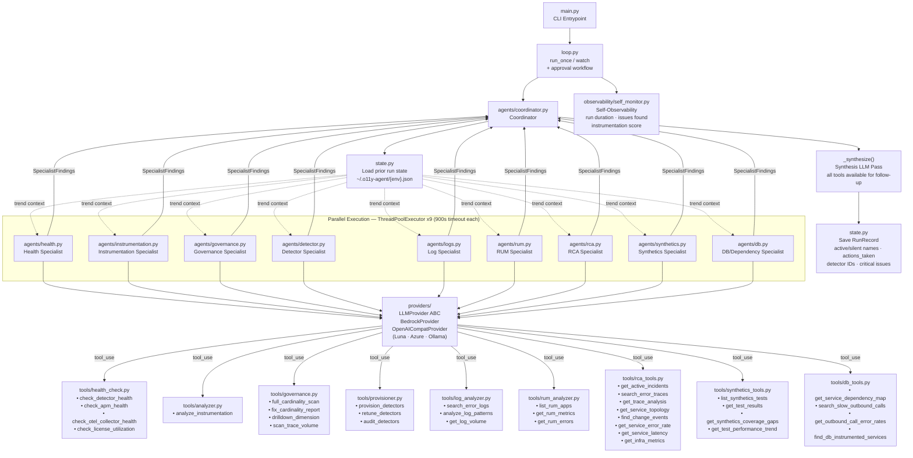

# Autonomous O11y Agent

Autonomous observability agent for Splunk Observability Cloud. Runs **nine specialist AI agents** in parallel — health auditing, instrumentation analysis, cardinality governance, detector lifecycle, log analysis, RUM/frontend monitoring, root cause analysis, synthetics coverage, and database/dependency health — then synthesizes their findings into a prioritized assessment. Supports AWS Bedrock and any OpenAI-compatible LLM (Luna, Azure OpenAI, Ollama).

---

## Deployment Modes

| Mode | How | Best for |
|---|---|---|
| **Batch** | CronJob (or local cron) | Periodic deep assessments — no persistent pod required |
| **Streaming** | Always-on Deployment + OTLP/HTTP receiver | Real-time PII detection, attribute validation, cardinality alerts as telemetry flows through |

In **streaming mode**, the agent co-deploys alongside your OTel Collector **gateway** node. The gateway fans a copy of all traces and metrics to the agent's OTLP/HTTP receiver (port 4318) via a secondary exporter with `retry_on_failure: false` — the agent is never on the critical path for the primary Splunk export.

---

## Architecture

### Batch Mode (Periodic Assessment)



### Streaming Mode (Gateway Co-Deployment)

```mermaid
flowchart TD
    GW["OTel Collector Gateway\nsplunk-otel-collector"]
    SPLUNK["Splunk Observability Cloud\nprimary export path"]
    RECV["receiver/otlp_receiver.py\nFlask OTLP/HTTP :4318\nencoding: json REQUIRED\n/v1/traces  /v1/metrics\n/healthz  /status"]
    PIPE["streaming/pipeline.py\nStreamingPipeline\nfan-out orchestrator"]

    PII["streaming/pii_scanner.py\nPII / PCI Scanner\ncard numbers, SSN, email\nCRITICAL alert on match"]
    ATTR["streaming/attribute_checker.py\nAttribute Checker\ndeployment.environment\nhost.name · k8s.pod.name"]
    CARD["streaming/cardinality_tracker.py\nCardinality Tracker\nsliding-window unique combos\nwarn@10K · critical@50K"]
    SVC["streaming/service_tracker.py\nService Tracker\nseeded from state on startup\nnew service.name → provisioning"]

    DISP["streaming/alerts.py\nAlertDispatcher\ndedup + cooldown window\nstdout + optional webhook"]
    OBS["streaming/observations.py\nObservationBuffer\n2h sliding window\nshared with batch assessment"]

    PROV["Provisioning Callback\nauto-provision detectors\nfor new services"]
    BATCH["Scheduled Batch Assessment\nruns every N minutes\ninjects ObservationBuffer context\ninto specialist prompts"]

    GW -->|primary| SPLUNK
    GW -->|fanout copy\nencoding=json\nretry_on_failure=false| RECV
    RECV --> PIPE

    PIPE --> PII
    PIPE --> ATTR
    PIPE --> CARD
    PIPE --> SVC

    PII --> DISP
    ATTR --> DISP
    CARD --> DISP
    SVC --> PROV

    DISP --> OBS
    OBS -.->|"summarize()"| BATCH

    subgraph agent ["O11y Agent Pod (always-on Deployment)"]
        RECV
        PIPE
        PII
        ATTR
        CARD
        SVC
        DISP
        OBS
        PROV
        BATCH
    end
```



### Component Breakdown

| Layer | File(s) | Responsibility |
|---|---|---|
| **Entrypoint** | `main.py`, `loop.py` | CLI arg parsing, batch/streaming mode, watch loop, approval integration |
| **Coordinator** | `agents/coordinator.py` | Parallel 9-specialist dispatch, cross-domain analysis, synthesis, state, `run_incident_rca()` |
| **Agent Loop** | `agent_loop.py` | Provider-agnostic tool-calling loop; concurrent tool execution per turn |
| **LLM Providers** | `providers/bedrock.py`<br>`providers/openai_compat.py` | Bedrock (default) + any OpenAI-compatible endpoint (Luna, Azure, Ollama) |
| **Specialists** | `agents/health.py`<br>`agents/instrumentation.py`<br>`agents/governance.py`<br>`agents/detector.py`<br>`agents/logs.py`<br>`agents/rum.py`<br>`agents/rca.py`<br>`agents/synthetics.py`<br>`agents/db.py` | Domain-scoped LLM reasoning + structured `SpecialistFindings` output |
| **Tools** | `tools/health_check.py`<br>`tools/analyzer.py`<br>`tools/governance.py`<br>`tools/provisioner.py`<br>`tools/log_analyzer.py`<br>`tools/rum_analyzer.py`<br>`tools/rca_tools.py`<br>`tools/synthetics_tools.py`<br>`tools/db_tools.py` | Subprocess wrappers (health/instr/gov/detector) + direct Splunk REST/SignalFlow/GraphQL/Synthetics APIs |
| **Findings** | `tools/findings.py` | `SpecialistFindings` + `Issue` dataclasses; `SUBMIT_SCHEMA`; `actions_taken` audit trail |
| **OTLP Receiver** | `receiver/otlp_receiver.py` | Flask app receiving gateway-fanned traces/metrics; JSON only — warns on protobuf |
| **Streaming Pipeline** | `streaming/pipeline.py` | Fan-out orchestrator; mirrors alerts into `ObservationBuffer` |
| **Observation Buffer** | `streaming/observations.py` | 2h sliding-window buffer shared between streaming detectors and batch assessments |
| **PII Scanner** | `streaming/pii_scanner.py` | Regex scan of span attributes for PCI card numbers, SSN, email, phone |
| **Attribute Checker** | `streaming/attribute_checker.py` | Validates required OTel attributes on every span/metric data point |
| **Cardinality Tracker** | `streaming/cardinality_tracker.py` | Sliding-window unique-combo counter; generates drop YAML on breach |
| **Service Tracker** | `streaming/service_tracker.py` | Seeded from state on startup; fires provisioning callback on new `service.name` |
| **Alerts** | `streaming/alerts.py` | Thread-safe alert dispatcher: dedup by key+cooldown, stdout + webhook |
| **Approval Workflow** | `approval/workflow.py` | Human-in-the-loop review of HIGH/CRITICAL actions: interactive, webhook, or auto |
| **State** | `state.py` | `RunRecord` with `active_service_names`, `silent_service_names`, `actions_taken`, trend context |
| **Config** | `config.py` | `AgentConfig` dataclass; realm, token, environment, provider, streaming, alerts, timeouts |
| **Self-Monitor** | `observability/self_monitor.py` | OTel SDK instrumentation of agent's own operations; emits spans + metrics |
| **Helm Chart** | `charts/o11y-agent/` | `mode.type: streaming` → Deployment; `mode.type: batch` → CronJob |

---

## Key Design Decisions

**1. Nine specialists, two levels of parallelism**
- The coordinator launches all 9 specialists simultaneously via `ThreadPoolExecutor(max_workers=9)`
- Within each specialist, when the LLM returns multiple `tool_use` blocks in one turn, all tools execute concurrently — eliminating sequential bottlenecks inside a single agent turn
- Each specialist has a 900s wall-clock timeout (`SPECIALIST_TIMEOUT`) so a stuck call can never hang the full run

**2. Structured output from every specialist**
- Each specialist returns a typed `SpecialistFindings` dataclass — not freeform text
- Fields: `services_active[]`, `services_silent[]`, `instrumentation_score`, `issues[]`, `metrics{}`, `actions_taken[]`
- Cross-domain analysis and state persistence work from structured fields — no regex extraction

**3. Synthesis with full tool access**
- The final synthesis LLM pass receives all tools (from all 9 specialists) for targeted follow-up
- Cross-domain analysis (service/issue mapping across all 9 findings) is pre-computed and injected into the synthesis prompt

**4. Streaming and batch share context via ObservationBuffer**
- The streaming pipeline writes every PII hit, new service, cardinality spike, and attribute gap into a 2h `ObservationBuffer`
- When a scheduled batch assessment runs, `ObservationBuffer.summarize()` is injected into each specialist's trend context
- Specialists see "3 new services appeared in the last hour, PII detected in payment-service at 14:32" alongside their API-sourced findings

**5. Persistent memory and audit trail**
- Each run records: active/silent service names, deployed detector IDs, critical issues, and `actions_taken` (what was actually changed)
- `trend_context()` surfaces prior silent services, deployed detectors, and prior actions for verification on the next run
- Consecutive silence detection: services silent for 2+ runs are flagged as likely instrumentation failures
- Stored at `~/.o11y-agent/{environment}.json`, capped at 30 runs per environment

**6. Multi-provider LLM support**
- `providers/` module abstracts the LLM call behind a `LLMProvider` interface
- `BedrockProvider`: default, uses `boto3` Converse API
- `OpenAICompatProvider`: any OpenAI Chat Completions endpoint — Galileo Luna, Azure OpenAI, Google Vertex, Ollama
- Schema conversion is automatic: internal Bedrock `toolSpec` format is converted to OpenAI function format on the fly
- Switch with `LLM_PROVIDER=openai OPENAI_BASE_URL=http://localhost:8080/v1`

**7. Human-in-the-loop approval workflow**
- In dry-run mode (`auto_apply=False`), HIGH and CRITICAL issues are extracted as numbered `PendingAction` items
- Three approval modes: **interactive** (stdin prompt), **webhook** (POST `{"approved": [1,3]}` to `APPROVAL_WEBHOOK_URL`), **auto** (non-interactive environments)
- Applied actions are logged back into `RunRecord.actions_taken` for the audit trail

**8. Gateway co-deployment — agent never on critical path**
- Gateway adds a secondary `otlp/o11y_agent` exporter with `encoding: json`, `retry_on_failure: false`, `timeout: 5s`
- The receiver emits a once-per-process warning with fix instructions if it receives protobuf payloads
- `ServiceTracker` is seeded from state on every pod restart — existing services never trigger provisioning callbacks

**9. Agent self-observability**
- `observability/self_monitor.py` wraps every run with OTel spans and emits four metrics:
  - `o11y_agent.run.duration` (histogram), `o11y_agent.issues.found` (counter by severity)
  - `o11y_agent.instrumentation_score` (gauge), `o11y_agent.silent_services` (gauge)
- Zero overhead when OTel SDK is not installed — graceful no-op
- Activated by `OTEL_EXPORTER_OTLP_ENDPOINT`; build dashboards and detectors on the agent itself

---

## Prerequisites

The tool projects must be cloned as siblings to this repo:

```
Documents/
  autonomous-o11y-agent/            ← this repo
  auto-detector-provisioner/
  o11y-usage-governance/
  o11y-instrumentation-analyzer/
  splunk-o11y-health-check/
```

Install each project's dependencies:

```bash
pip install -r ../auto-detector-provisioner/requirements.txt
pip install -r ../o11y-usage-governance/requirements.txt
pip install -r ../o11y-instrumentation-analyzer/requirements.txt
pip install -r ../splunk-o11y-health-check/requirements-health-hub.txt
```

## Setup

```bash
cd autonomous-o11y-agent

# Core install (Bedrock only)
pip install -e .

# With OpenAI-compatible provider support (Luna, Azure, Ollama)
pip install -e ".[openai]"

# With agent self-observability (OTel SDK)
pip install -e ".[observability]"

# Everything
pip install -e ".[all]"
```

### Environment Variables

**Required (or pass as CLI flags):**

| Variable | Description |
|---|---|
| `SPLUNK_REALM` | Splunk Observability realm (e.g. `us1`) |
| `SPLUNK_ACCESS_TOKEN` | Splunk API access token |
| `SPLUNK_ENVIRONMENT` | Target environment name |
| `AWS_DEFAULT_REGION` | AWS region for Bedrock (default: `us-west-2`) |
| `AWS_ACCESS_KEY_ID` | AWS credentials for Bedrock |
| `AWS_SECRET_ACCESS_KEY` | AWS credentials for Bedrock |

**LLM provider (OpenAI-compatible):**

| Variable | Default | Description |
|---|---|---|
| `LLM_PROVIDER` | `bedrock` | `bedrock` or `openai` (any OpenAI-compatible endpoint) |
| `OPENAI_BASE_URL` | _(none)_ | Base URL for OpenAI-compatible endpoint (e.g. `http://localhost:8080/v1`) |
| `OPENAI_API_KEY` | _(none)_ | API key for the OpenAI-compatible endpoint |
| `OPENAI_MODEL` | _(none)_ | Model name to use (e.g. `luna`, `gpt-4o`, `mistral`) |

**Streaming mode:**

| Variable | Default | Description |
|---|---|---|
| `OTLP_RECEIVER_PORT` | `4318` | Port for the OTLP/HTTP receiver |
| `OTLP_RECEIVER_HOST` | `0.0.0.0` | Bind address for the OTLP/HTTP receiver |
| `ALERT_WEBHOOK_URL` | _(none)_ | Webhook URL for streaming alert notifications |
| `ALERT_COOLDOWN_SECONDS` | `300` | Minimum seconds between repeated alerts for the same issue |

**Tuning:**

| Variable | Default | Description |
|---|---|---|
| `SPECIALIST_TIMEOUT` | `900` | Max seconds per specialist agent before timeout |
| `TOOL_TIMEOUT` | `300` | Max seconds per subprocess tool call |

**Approval workflow:**

| Variable | Default | Description |
|---|---|---|
| `APPROVAL_WEBHOOK_URL` | _(none)_ | Webhook to POST pending actions to; expects `{"approved": [1,3]}` response |
| `APPROVAL_TIMEOUT_SECONDS` | `0` | Auto-approve all after N seconds with no webhook response (0 = wait indefinitely) |

**Self-observability:**

| Variable | Description |
|---|---|
| `OTEL_EXPORTER_OTLP_ENDPOINT` | OTLP endpoint to send agent spans/metrics to (e.g. `http://localhost:4318`) |

**Optional path overrides (defaults to sibling directories):**

| Variable | Description |
|---|---|
| `PROVISIONER_PATH` | Path to auto-detector-provisioner |
| `GOVERNANCE_PATH` | Path to o11y-usage-governance |
| `ANALYZER_PATH` | Path to o11y-instrumentation-analyzer |
| `HEALTH_CHECK_PATH` | Path to splunk-o11y-health-check |

---

## Usage

### Batch Mode

```bash
# One-shot full assessment (dry-run — no changes made, approval workflow shown)
python3 main.py --realm us1 --token $TOKEN --environment production

# One-shot with auto-apply (deploys detectors, applies fixes, no approval prompt)
python3 main.py --realm us1 --token $TOKEN --environment production --auto-apply

# Scope to a specific service
python3 main.py --realm us1 --token $TOKEN --environment production --service payment-service

# Ask the agent a specific question
python3 main.py --realm us1 --token $TOKEN --environment production \
  --prompt "Which services have the worst instrumentation coverage and why?"

# Continuous watch mode — runs every 60 minutes, approval workflow between runs
python3 main.py --realm us1 --token $TOKEN --environment production --watch

# Watch mode with custom interval and auto-apply
python3 main.py --realm us1 --token $TOKEN --environment production \
  --watch --interval 30 --auto-apply
```

### Using an OpenAI-Compatible LLM (Luna, Azure, Ollama)

```bash
# Galileo Luna (self-hosted)
LLM_PROVIDER=openai \
OPENAI_BASE_URL=http://your-luna-host:8080/v1 \
OPENAI_MODEL=luna \
OPENAI_API_KEY=none \
python3 main.py --realm us1 --token $TOKEN --environment production

# Azure OpenAI
LLM_PROVIDER=openai \
OPENAI_BASE_URL=https://your-resource.openai.azure.com/openai/deployments/gpt-4o \
OPENAI_API_KEY=$AZURE_OPENAI_KEY \
OPENAI_MODEL=gpt-4o \
python3 main.py --realm us1 --token $TOKEN --environment production

# Local Ollama
LLM_PROVIDER=openai \
OPENAI_BASE_URL=http://localhost:11434/v1 \
OPENAI_MODEL=llama3.1 \
OPENAI_API_KEY=none \
python3 main.py --realm us1 --token $TOKEN --environment production
```

### Streaming Mode

```bash
# Start the OTLP/HTTP receiver + run a batch assessment every 60 minutes
python3 main.py --realm us1 --token $TOKEN --environment production --streaming

# Streaming only (receive telemetry + real-time alerts, no batch assessments)
python3 main.py --realm us1 --token $TOKEN --environment production --streaming-only

# Streaming with alert webhook and 30-minute batch interval
ALERT_WEBHOOK_URL=https://hooks.example.com/o11y-alerts \
python3 main.py --realm us1 --token $TOKEN --environment production \
  --streaming --interval 30 --auto-apply
```

The receiver listens on `http://0.0.0.0:4318`. Configure your gateway exporter:

```yaml
exporters:
  otlp/o11y_agent:
    endpoint: "http://<agent-host>:4318"
    encoding: json      # REQUIRED — receiver parses JSON only
    tls:
      insecure: true
    retry_on_failure:
      enabled: false    # never block primary export path
    timeout: 5s

service:
  pipelines:
    traces:
      exporters: [splunk_hec/traces, signalfx, otlp/o11y_agent]
    metrics:
      exporters: [signalfx, otlp/o11y_agent]
```

### Kubernetes Deployment (Helm)

```bash
# Streaming mode (default) — always-on pod with OTLP receiver
helm install o11y-agent ./charts/o11y-agent \
  --set splunk.realm=us1 \
  --set splunk.accessToken=$SPLUNK_ACCESS_TOKEN \
  --set aws.accessKeyId=$AWS_ACCESS_KEY_ID \
  --set aws.secretAccessKey=$AWS_SECRET_ACCESS_KEY \
  --set aws.region=us-west-2 \
  --set splunk.environment=production

# Batch mode — CronJob instead of Deployment
helm install o11y-agent ./charts/o11y-agent \
  --set mode.type=batch \
  --set mode.schedule="0 * * * *" \
  --set splunk.realm=us1 ...

# Patch your existing gateway to fan out to the agent (one command):
helm upgrade splunk-otel-collector splunk-otel/splunk-otel-collector \
  -f <(kubectl get cm o11y-agent-gateway-patch \
           -o jsonpath='{.data.values\.yaml}')
```

### Agent Self-Observability

```bash
# Point the agent at its own OTel Collector to emit self-monitoring telemetry
OTEL_EXPORTER_OTLP_ENDPOINT=http://localhost:4318 \
python3 main.py --realm us1 --token $TOKEN --environment production --watch
```

The agent emits spans (`o11y_agent.assessment`, `o11y_agent.specialist_run`) and metrics to your Splunk Observability Cloud instance. Build a dashboard on `o11y_agent.*` metrics to track assessment cadence, issue trends, and instrumentation score over time.

---

## What Each Specialist Does

### Health Specialist
- Checks detector alert coverage across all services
- Audits APM health: error rates, latency, and throughput per service
- Checks OTel Collector pipeline health and drop rates
- Reviews license utilization against entitlements

### Instrumentation Specialist
- Analyzes span quality: missing attributes, wrong span kinds, incomplete traces
- Checks metric coverage: which services emit which signal types
- Identifies services with no traces, no metrics, or no logs
- Scores overall instrumentation quality (0–100)

### Governance Specialist
- Scans for metric cardinality explosions with MTS counts and cost estimates
- Detects slow-burn anomalies: metrics growing faster than their 7-day baseline
- Generates ready-to-paste OTel Collector YAML fixes per offending dimension
- Snapshots trace volume per service to detect unexpected spikes

### Detector Specialist
- Discovers services with no detector coverage ("dark" services)
- Learns behavioral baselines from live telemetry (p50/p95/p99, error rates, req rates)
- Provisions or recommends best-practice detectors tuned to actual traffic patterns
- Retunes existing detectors when baselines have drifted
- Auto-detects GenAI/agentic services and applies specialized detector templates
- Populates `actions_taken` with every detector deployed or retuned (audit trail)

### Log Specialist
- Searches for ERROR/CRITICAL log entries across all services
- Groups log messages by fingerprint to surface top recurring error patterns
- Identifies services with zero log output (complete logging gap)
- Flags log volume anomalies: services generating disproportionate log traffic
- Correlates log error counts with APM error rates to distinguish instrumentation gaps from real failures
- Uses Splunk Observability REST API directly — no subprocess dependency

### RUM Specialist
- Discovers which frontend applications are instrumented with Splunk RUM
- Assesses session volume, JavaScript error rates, and Core Web Vitals (LCP, FID, CLS) per app
- Surfaces unconfigured frontends — services expected to have RUM but reporting no data
- Identifies high JS error rates, poor Core Web Vitals thresholds, and top recurring error types
- Distinguishes instrumentation gaps (RUM not configured) from real UX degradation
- Uses SignalFlow to query `rum.*` metrics from the Splunk Observability streaming API

### RCA Specialist
- **Reactive investigator** — discovers active incidents and performs end-to-end root cause analysis
- Searches for error traces around the incident start time using APM GraphQL async search
- Analyzes `topLatencyContributors` per trace to pinpoint the exact service/operation causing slowness
- Maps the full service dependency graph to assess blast radius (upstream callers + downstream deps)
- Correlates deployment/change events in the 90-minute window before the incident (deployment-triggered regressions)
- Queries error rate and p99 latency time series to establish the precise incident timeline
- Checks Kubernetes pod CPU and memory metrics for resource exhaustion as a potential cause
- Produces a **causal chain** conclusion with confidence level: `HIGH` (clear evidence), `MEDIUM` (correlated), or `LOW` (insufficient data)
- Can also be triggered directly from streaming alerts via `coordinator.run_incident_rca(config, service, incident_id, start_ms)`

### Synthetics Specialist
- Inventories all Splunk Synthetics tests: browser, API, and uptime checks
- Identifies services and critical user journeys with **no external health validation** (coverage gaps)
- Surfaces currently failing tests with specific error messages and per-location failure breakdown
- Detects tests with a **degrading performance trend** — getting slower before they fail outright
- Flags misconfigured tests: inactive/paused, too-infrequent (>10 min), or single-location only
- Computes uptime percentage per test over configurable time windows

### Database/Dependency Specialist
- Maps the full service dependency topology including **inferred (unmonitored) service nodes** — databases and external APIs that services call but that have no instrumentation of their own
- Classifies inferred nodes as DB vs external API and surfaces them as observability blind spots
- Checks `db.system`, `db.name`, and `db.operation` attribute coverage per service — missing attributes break APM Database Overview and prevent query-level visibility
- Proactively surfaces the **slowest outbound calls** (DB queries, external APIs) before they cause incidents
- Detects per-service outbound error rates: high client-span errors indicate a dependency is unhealthy, not the calling service itself

---

## Project Structure

```
autonomous-o11y-agent/
├── main.py                    # CLI entrypoint — batch, streaming, approval, self-monitoring
├── loop.py                    # run_once() and watch() loop + approval integration
├── agent.py                   # build_agent() — wires config to coordinator
├── agent_loop.py              # Provider-agnostic tool-calling loop
├── config.py                  # AgentConfig dataclass (provider, streaming, timeouts, approval)
├── state.py                   # RunRecord + trend_context() + build_run_record()
├── generate_report.py         # DOCX report generator
│
├── providers/                 # LLM provider abstraction (Gap 6)
│   ├── base.py                # LLMProvider ABC
│   ├── bedrock.py             # AWS Bedrock Converse API
│   └── openai_compat.py       # OpenAI-compatible (Luna · Azure · Vertex · Ollama)
│
├── agents/
│   ├── coordinator.py         # 9-specialist parallel dispatch, cross-domain analysis, synthesis, run_incident_rca()
│   ├── health.py              # Health specialist → SpecialistFindings
│   ├── instrumentation.py     # Instrumentation specialist → SpecialistFindings
│   ├── governance.py          # Governance specialist → SpecialistFindings
│   ├── detector.py            # Detector specialist → SpecialistFindings + actions_taken
│   ├── logs.py                # Log specialist → SpecialistFindings
│   ├── rum.py                 # RUM specialist → Core Web Vitals, JS errors
│   ├── rca.py                 # RCA specialist → causal chain investigation
│   ├── synthetics.py          # Synthetics specialist → test coverage, failures, trends
│   └── db.py                  # DB/Dependency specialist → topology, blind spots, db attr coverage
│
├── tools/
│   ├── health_check.py        # Wraps splunk-o11y-health-check
│   ├── analyzer.py            # Wraps o11y-instrumentation-analyzer
│   ├── governance.py          # Wraps o11y-usage-governance + full_cardinality_scan
│   ├── provisioner.py         # Wraps auto-detector-provisioner
│   ├── log_analyzer.py        # Splunk REST: error logs, patterns, volume
│   ├── rum_analyzer.py        # SignalFlow: rum.* metrics, Core Web Vitals, JS errors
│   ├── rca_tools.py           # APM GraphQL + SignalFlow + REST: incidents, traces, topology, events
│   ├── synthetics_tools.py    # Splunk Synthetics REST: tests, results, coverage gaps, trends
│   ├── db_tools.py            # APM GraphQL + SignalFlow + MTS: dependency map, slow calls, db attrs
│   ├── findings.py            # SpecialistFindings · Issue · SUBMIT_SCHEMA · actions_taken
│   └── _runner.py             # Shared subprocess runner + batch_run() parallel exec
│
├── streaming/
│   ├── pipeline.py            # StreamingPipeline fan-out + ObservationBuffer bridge
│   ├── observations.py        # ObservationBuffer — 2h sliding window (new)
│   ├── pii_scanner.py         # PCI/PII regex scanner (card numbers, SSN, email, phone)
│   ├── attribute_checker.py   # Required OTel attribute validator (spans + metrics)
│   ├── cardinality_tracker.py # Sliding-window cardinality counter + drop YAML generator
│   ├── service_tracker.py     # New service.name detector + provisioning callback
│   └── alerts.py              # AlertDispatcher — dedup, cooldown, stdout + webhook
│
├── receiver/
│   └── otlp_receiver.py       # Flask OTLP/HTTP receiver — JSON only, protobuf warning
│
├── approval/                  # Human-in-the-loop workflow (new)
│   └── workflow.py            # PendingAction · ApprovalWorkflow (interactive/webhook/auto)
│
├── observability/             # Agent self-observability (new)
│   └── self_monitor.py        # OTel spans + metrics for agent's own operations
│
└── charts/
    └── o11y-agent/
        ├── Chart.yaml
        ├── values.yaml        # mode.type, receiver, alerts, persistence, gatewayPatch
        └── templates/
            ├── deployment.yaml               # streaming mode — always-on pod
            ├── cronjob.yaml                  # batch mode — scheduled CronJob
            ├── service.yaml                  # ClusterIP exposing OTLP port
            ├── gateway-patch-configmap.yaml  # encoding:json + values fragment for helm upgrade
            ├── pvc.yaml                      # persistent state volume
            ├── secret.yaml                   # Splunk + AWS credentials
            ├── serviceaccount.yaml
            └── _helpers.tpl
```
