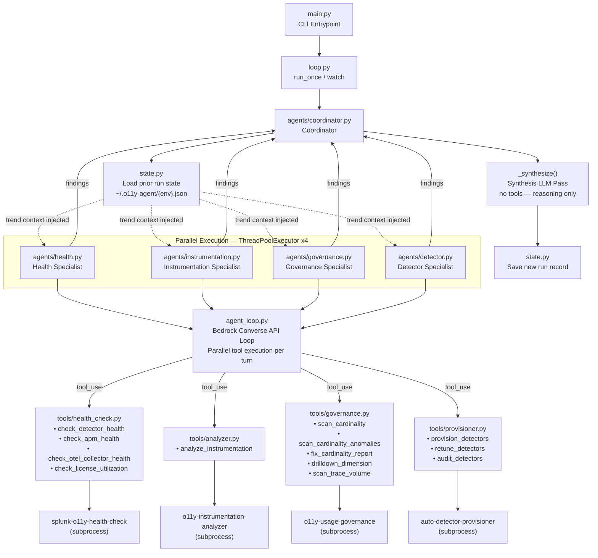

# Autonomous O11y Agent

Autonomous observability agent for Splunk Observability Cloud. Runs four specialist AI agents in parallel — health auditing, instrumentation analysis, cardinality governance, and detector lifecycle — then synthesizes their findings into a prioritized assessment using Claude via AWS Bedrock.

---

## Architecture



### Component Breakdown

| Layer | File(s) | Responsibility |
|---|---|---|
| **Entrypoint** | `main.py`, `loop.py` | CLI arg parsing, watch mode, output formatting |
| **Coordinator** | `agents/coordinator.py` | Parallel dispatch of specialists, final synthesis, state persistence |
| **Agent Loop** | `agent_loop.py` | Bedrock Converse API tool-calling loop; concurrent tool execution per turn |
| **Specialists** | `agents/health.py`<br>`agents/instrumentation.py`<br>`agents/governance.py`<br>`agents/detector.py` | Domain-scoped LLM reasoning + tool use |
| **Tools** | `tools/health_check.py`<br>`tools/analyzer.py`<br>`tools/governance.py`<br>`tools/provisioner.py` | Subprocess wrappers around sibling CLI projects |
| **State** | `state.py` | Persistent JSON run history for trend detection |
| **Config** | `config.py` | `AgentConfig` dataclass; realm, token, environment, paths |

### Key Design Decisions

**1. Two levels of parallelism**
- The coordinator launches all 4 specialists simultaneously via `ThreadPoolExecutor(max_workers=4)`
- Within each specialist, when Claude returns multiple `tool_use` blocks in one turn, all tools execute concurrently — eliminating sequential bottlenecks inside a single agent turn

**2. Synthesis-only final pass**
- After all specialists complete, the coordinator runs one final LLM call with no tools
- Gets all 4 specialist findings as input and produces a unified, cross-domain assessment
- Enables cross-cutting insights that no single specialist can produce alone (e.g. correlating a service that has traffic baselines from the detector agent but shows as silent in the health agent)

**3. Persistent memory and trend detection**
- Each run records instrumentation score, active/silent service counts, detector count, and cardinality issues
- Next run injects a trend context block so the agent can detect regressions, confirm improvements, or flag repeated unresolved issues
- Stored at `~/.o11y-agent/{environment}.json`, capped at 30 runs per environment

**4. Environment scoping at two layers**
- Hard filter in tool wrappers removes off-environment data before it reaches the LLM
- System prompts explicitly restrict each specialist to the target environment only
- Prevents org-wide noise (other teams' services, other environments) from polluting findings

**5. No agent framework dependency**
- Pure `boto3` Converse API — no Strands, LangChain, or other framework overhead
- The entire tool-calling loop is ~50 lines in `agent_loop.py`
- Bedrock config: `read_timeout=600` to handle long-running provisioner and synthesis calls

---

## Prerequisites

The four tool projects must be cloned as siblings to this repo:

```
Documents/
  autonomous-o11y-agent/            ← this repo
  auto-detector-provisioner/
  o11y-usage-governance/
  o11y-instrumentation-analyzer/
  splunk-o11y-health-check/
```

Install each project's dependencies:

```bash
pip install -r ../auto-detector-provisioner/requirements.txt
pip install -r ../o11y-usage-governance/requirements.txt
pip install -r ../o11y-instrumentation-analyzer/requirements.txt
pip install -r ../splunk-o11y-health-check/requirements-health-hub.txt
```

## Setup

```bash
cd autonomous-o11y-agent
pip install -e .
```

Required environment variables (or use CLI flags):

| Variable | Description |
|---|---|
| `SPLUNK_REALM` | Splunk Observability realm (e.g. `us1`) |
| `SPLUNK_ACCESS_TOKEN` | Splunk API access token |
| `SPLUNK_ENVIRONMENT` | Target environment name |
| `AWS_DEFAULT_REGION` | AWS region for Bedrock (default: `us-west-2`) |
| `AWS_ACCESS_KEY_ID` | AWS credentials |
| `AWS_SECRET_ACCESS_KEY` | AWS credentials |

Optional path overrides (defaults to sibling directories):

| Variable | Description |
|---|---|
| `PROVISIONER_PATH` | Path to auto-detector-provisioner |
| `GOVERNANCE_PATH` | Path to o11y-usage-governance |
| `ANALYZER_PATH` | Path to o11y-instrumentation-analyzer |
| `HEALTH_CHECK_PATH` | Path to splunk-o11y-health-check |

---

## Usage

```bash
# One-shot full assessment (dry-run — no changes made)
python3 main.py --realm us1 --token $TOKEN --environment production

# One-shot with auto-apply (deploys detectors, applies fixes)
python3 main.py --realm us1 --token $TOKEN --environment production --auto-apply

# Scope to a specific service
python3 main.py --realm us1 --token $TOKEN --environment production --service payment-service

# Ask the agent a specific question
python3 main.py --realm us1 --token $TOKEN --environment production \
  --prompt "Which services have the worst instrumentation coverage and why?"

# Continuous watch mode — runs every 60 minutes
python3 main.py --realm us1 --token $TOKEN --environment production --watch

# Watch mode with custom interval and auto-apply
python3 main.py --realm us1 --token $TOKEN --environment production \
  --watch --interval 30 --auto-apply
```

---

## What Each Specialist Does

### Health Specialist
- Checks detector alert coverage across all services
- Audits APM health: error rates, latency, and throughput per service
- Checks OTel Collector pipeline health and drop rates
- Reviews license utilization against entitlements

### Instrumentation Specialist
- Analyzes span quality: missing attributes, wrong span kinds, incomplete traces
- Checks metric coverage: which services emit which signal types
- Identifies services with no traces, no metrics, or no logs
- Scores overall instrumentation quality (0–100)

### Governance Specialist
- Scans for metric cardinality explosions with MTS counts and cost estimates
- Detects slow-burn anomalies: metrics growing faster than their 7-day baseline
- Generates ready-to-paste OTel Collector YAML fixes per offending dimension
- Snapshots trace volume per service to detect unexpected spikes

### Detector Specialist
- Discovers services with no detector coverage ("dark" services)
- Learns behavioral baselines from live telemetry (p50/p95/p99, error rates, req rates)
- Provisions or recommends best-practice detectors tuned to actual traffic patterns
- Retunes existing detectors when baselines have drifted
- Auto-detects GenAI/agentic services and applies specialized detector templates

---

## Project Structure

```
autonomous-o11y-agent/
├── main.py                 # CLI entrypoint
├── loop.py                 # run_once() and watch() loop
├── agent.py                # build_agent() — wires config to coordinator
├── agent_loop.py           # Bedrock Converse API tool-calling loop
├── config.py               # AgentConfig dataclass
├── state.py                # Persistent run state + trend detection
├── agents/
│   ├── coordinator.py      # Parallel dispatch + synthesis
│   ├── health.py           # Health specialist
│   ├── instrumentation.py  # Instrumentation specialist
│   ├── governance.py       # Governance specialist
│   └── detector.py         # Detector specialist
└── tools/
    ├── health_check.py     # Wraps splunk-o11y-health-check
    ├── analyzer.py         # Wraps o11y-instrumentation-analyzer
    ├── governance.py       # Wraps o11y-usage-governance
    ├── provisioner.py      # Wraps auto-detector-provisioner
    └── _runner.py          # Shared subprocess runner + config injection
```
