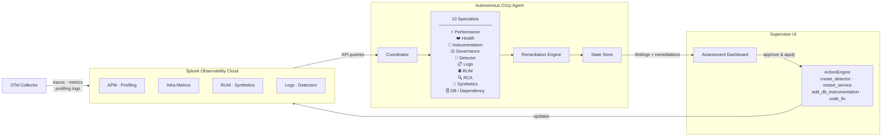

# Autonomous O11y Agent

Runs ten specialist AI agents in parallel against Splunk Observability Cloud, then synthesizes their findings into a prioritized assessment with automated remediations. Supports AWS Bedrock and any OpenAI-compatible LLM.

## Architecture



## Quick start

```bash
pip install -e .

# One-shot assessment
python3 main.py --realm us1 --token $TOKEN --environment production

# Watch mode (runs every 60 min)
python3 main.py --realm us1 --token $TOKEN --environment production --watch

# Streaming mode (always-on OTLP receiver + batch assessments)
python3 main.py --realm us1 --token $TOKEN --environment production --streaming

# Ask a specific question
python3 main.py --realm us1 --token $TOKEN --environment production \
  --prompt "Which services have the worst instrumentation coverage?"
```

## Docker Compose (local demo stack)

Runs the full stack locally: Astronomy Shop → Splunk OTel Collector → O11y Agent → Supervisor UI.

```bash
cd deploy
cp .env.example .env   # fill in credentials
docker compose up -d
```

| | URL |
|---|---|
| Astronomy Shop | http://localhost:8080 |
| Supervisor UI (agent findings) | http://localhost:9090 |
| Locust load generator | http://localhost:8089 |

See [deploy/README.md](deploy/README.md) for full setup instructions.

## Specialists

| Specialist | What it assesses |
|---|---|
| **Health** | Detector coverage, APM error/latency, OTel Collector pipeline health, license utilization |
| **Instrumentation** | Span quality, missing attributes, signal coverage per service, overall score (0–100) |
| **Governance** | Metric cardinality explosions, slow-burn MTS growth, trace volume anomalies |
| **Detector** | Dark services, behavioral baselines, detector provisioning and retuning |
| **Logs** | Error log patterns, volume anomalies, services with zero log output |
| **RUM** | Frontend JS errors, Core Web Vitals (LCP, FID, CLS), unconfigured RUM apps |
| **RCA** | Active incident investigation, causal chain analysis, change correlation |
| **Synthetics** | Test coverage gaps, failing tests, degrading performance trends |
| **DB/Dependency** | Inferred service topology, slow outbound calls, `db.*` attribute coverage |
| **Performance** | AlwaysOn Profiling hotspots, N+1 query patterns, latency outliers, code-level fix generation |

### Performance specialist tiers

The performance specialist degrades gracefully based on available data:

| Tier | Requires | Output |
|---|---|---|
| **A** | AlwaysOn Profiling + source code | Exact file:line diff ready to apply |
| **B** | AlwaysOn Profiling only | file:line:function with precise fix description |
| **C** | Span patterns only (always available) | Operation-level N+1 / latency fix recommendation |
| **D** | Nothing detectable | Skipped — no findings emitted |

Configure source code access via `SOURCE_ROOT` (local path) or `GITHUB_TOKEN` + `GITHUB_REPO`.

## Deployment modes

| Mode | Command flag | Best for |
|---|---|---|
| Batch | _(default)_ | Periodic deep assessments |
| Watch | `--watch` | Continuous scheduled assessment loop |
| Streaming | `--streaming` | Always-on OTLP receiver + real-time detection (PII, cardinality, new services) |

## LLM providers

```bash
# AWS Bedrock (default)
AWS_DEFAULT_REGION=us-west-2 python3 main.py ...

# Any OpenAI-compatible endpoint (Luna, Azure, Ollama)
LLM_PROVIDER=openai OPENAI_BASE_URL=http://localhost:11434/v1 OPENAI_MODEL=llama3.1 python3 main.py ...
```

## Tool dependencies

The agent calls four companion CLI tools. Clone them as siblings to this repo:

```
auto-detector-provisioner/
o11y-usage-governance/
o11y-instrumentation-analyzer/
splunk-o11y-health-check/
```

The agent degrades gracefully if any tool is missing — specialists that depend on it report the gap rather than crashing the full run.

## Remediation

After all specialists complete, the coordinator runs a rule-based remediation pass (`agents/remediation.py`) that maps critical and high-severity issues to actionable supervisor operations. The results are saved as `pending_remediations` in the assessment JSON.

Each remediation includes:
- `action_type` — the supervisor ActionEngine operation to run (e.g. `create_splunk_detector`, `reload_collector`, `restart_service`)
- `action_payload` — ready-to-execute arguments
- `auto_applicable` — `true` if the action can run without manual config edits

The Supervisor UI surfaces these as a **Pending Remediations** panel with per-item Apply buttons and a bulk "Apply Selected" option. Chat also accepts natural-language remediation requests ("apply the detector fix for checkout-service").

| Issue pattern | Action | Auto? |
|---|---|---|
| No detector / dark service (per-service) | `create_splunk_detector` (error_rate + latency) | ✅ |
| No detector coverage (org-wide) | `build_detectors` | ✅ |
| OTel Collector unreachable | `reload_collector` | ✅ |
| DB instrumentation missing (`db.system` absent) | `add_db_instrumentation` | ✅ |
| DB span attributes stripped by collector processor | `patch_collector_config` | ⬜ |
| Silent service / no telemetry | `restart_service` | ✅ |
| Detector threshold too tight / noisy | `rebaseline_detectors` | ✅ |
| Performance hotspot with profiling data | `generate_code_fix` (file:line diff) | ⬜ |

## Profiling Dashboard

The profiling dashboard (`http://localhost:4319/profiling`) provides real-time CPU profiling, call-graph analysis, and AI-generated code fixes — all running inside the agent without any external API calls.

### Instrumented services

Three services from the Astronomy Shop demo are fully instrumented with Splunk OTel profiling:

**Frontend — Node.js / TypeScript (Next.js 15)**
Frontend is a compiled service — TypeScript gets bundled by webpack into minified JavaScript. Without extra work, profiling would only show cryptic bundle paths like `/.next/server/chunks/abc123.js` — useless for debugging. Solved by building the container with source maps enabled and setting `NODE_OPTIONS=--enable-source-maps` so the V8 profiler reports original TypeScript file paths at runtime. A VLQ/Source Map v3 decoder in the agent resolves any remaining compiled `.js` references back to their original `.ts` file and line number. The source viewer shows real TypeScript code — `pages/api/cart.ts`, `lib/cartUtils.ts` — with the exact hot line highlighted.

**Payment — Node.js / TypeScript**
A low-traffic service that only runs during checkout flows. AlwaysOn CPU profiling is typically idle (the 10-second sampler rarely catches it mid-request). Snapshot profiling is the relevant signal, capturing the actual call stack during a real payment transaction. Method Hotspots surfaces outbound gRPC calls and stream I/O ranked by contribution percentage across all captured traces.

**Recommendation — Python**
Python source is not compiled or minified — what the profiler sees is exactly what the developer wrote, no translation needed. The recommendation service uses scikit-learn and numpy for ML-based product recommendations, making it CPU-bound rather than I/O-bound. The AlwaysOn flamegraph is the most consistently populated of the three. Source viewer shows direct Python file paths with no source map resolution required.

### What the agent detects

The agent pattern-matches the actual source code around the hot line to classify the issue:

| Issue type | Pattern detected | Severity |
|---|---|---|
| **Sync I/O in Hot Path** | `*Sync` calls (`readFileSync`, `execSync`) — blocks the event loop entirely | Amber |
| **N+1 Async Pattern** | `.map(async` or `for...of` + `await` — one serial round trip per item instead of a parallel batch | Red |
| **Serial Awaits (Parallelizable)** | Multiple `await` calls in sequence where neither depends on the other's result — can be rewritten with `Promise.all()` | Amber |
| **Waterfall Calls (Data-Dependent)** | Serial `await` calls where the second uses data from the first — acknowledged but `Promise.all()` is not suggested as it would break the logic | Grey |
| **Downstream Call** | Single `await` on an RPC/HTTP/gRPC call — flags it as the source of latency | Blue |
| **Lock Contention** | Thread wait, acquire, semaphore patterns — common in Python services with GIL contention | Pink |

### How AI fix generation works

When triggered, the agent sends four things to the LLM:

1. The service name and language
2. The blocking function and `file:line` (from the profiling call stack)
3. The app caller frame — the first line of user code above the blocking call
4. 25 lines of actual source code surrounding the hot line, pulled live from the running container via Docker socket

Because the LLM receives real source code in context — not just a function name — it returns a specific rewrite referencing the exact variable names, function signatures, and logic already in the file. The issue type classification also guides the fix: a `*Sync` → `fs.promises.*` rewrite, a `.map(async` → `Promise.all()` refactor, or a serial await → parallel await restructure.

### Dashboard panels

| Panel | What it shows |
|---|---|
| **AlwaysOn CPU Flamegraph** | 3-level icicle chart (category → package → function). Width = CPU share. 30-minute rolling window. |
| **Top CPU Functions** | Top 10 functions by CPU%, with issue type badge and link to source viewer |
| **Method Hotspots** | Aggregated view across all snapshot traces — contribution%, traces affected, worst trace, app caller frame. Mirrors Dynatrace's Method Hotspots panel. |
| **Snapshot Trace Explorer** | Per-trace call stacks with source code viewer and AI Fix button |

See [ROADMAP.md](ROADMAP.md) for planned enhancements including autonomous GitHub PR generation, P50/P99 split, and caller/callee breakdown.

## Supervisor UI integration

The [Splunk OTel Supervisor](https://github.com/mqbui1/splunk-otel-supervisor) renders assessment findings in a web dashboard. After each run the agent exposes `GET /api/assessment/latest` and the supervisor proxies it to its **Agent** tab. The **Pending Remediations** panel lets operators apply fixes with or without human approval. See [deploy/docs/supervisor-integration.md](deploy/docs/supervisor-integration.md).
